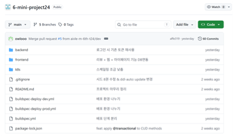
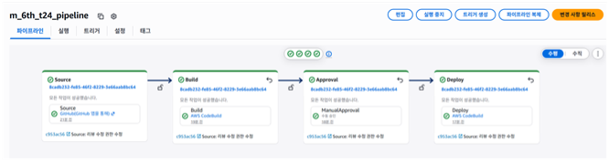
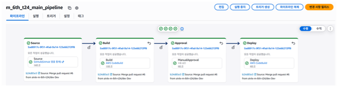
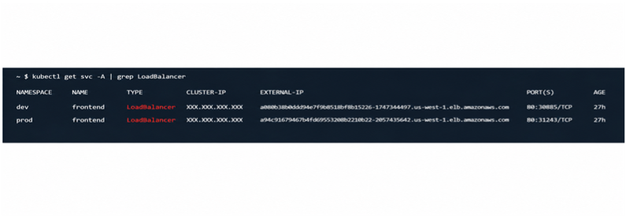
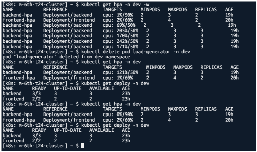
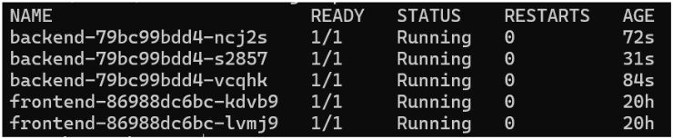
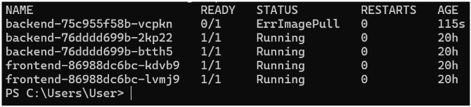
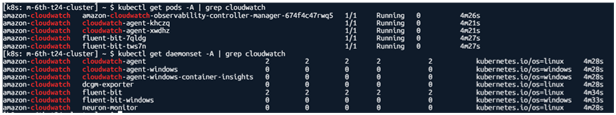
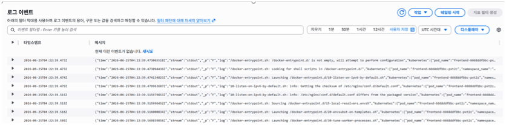

# 도서관리시스템 - AWS CI/CD & EKS 배포

> KT AIVLE School AI 트랙 미니프로젝트 6차
> GitHub, AWS CodePipeline, CodeBuild, ECR, EKS, CloudWatch를 활용한 도서관리 웹 서비스 자동 배포 환경 구축

[](https://spring.io/projects/spring-boot)
[](https://react.dev)
[](https://openjdk.org)
[](https://aws.amazon.com/eks/)

---

## 프로젝트 개요

기존 도서관리 시스템을 AWS 기반 CI/CD 환경으로 확장한 프로젝트입니다.
프론트엔드와 백엔드를 각각 Docker 이미지로 빌드한 뒤 Amazon ECR에 저장하고, AWS CodePipeline과 CodeBuild를 통해 EKS 클러스터의 dev/prod 환경에 자동 배포합니다.

주요 구현 범위는 다음과 같습니다.

- GitHub 기반 소스 관리 및 `dev`/`main` 브랜치 전략
- CodePipeline + CodeBuild 기반 CI/CD 파이프라인 구성
- Docker 이미지 빌드 및 Amazon ECR push
- EKS 클러스터, Managed Node Group, Kubernetes manifest 구성
- dev/prod namespace 분리 배포
- LoadBalancer Service를 통한 외부 접속
- Cloudflare 도메인 연결
- RDS MySQL 연동 및 로컬 H2 fallback
- HPA 기반 CPU Auto Scaling
- CloudWatch Observability, Logs, Container Insights 구성
- prod 배포 전 Manual Approval 단계 구성

---

## 서비스 주소

| 환경 | URL | 설명 |
|---|---|---|
| dev | <https://dev-m-6th-t24.ldhcloud.com> | 개발/검증용 배포 환경 |
| prod | <https://m-6th-t24.ldhcloud.com> | 운영 발표용 배포 환경 |

도메인은 Cloudflare CNAME을 통해 각 namespace의 `frontend` LoadBalancer에 연결합니다.

---

## 기술 스택

### Application

| 영역 | 기술 |
|---|---|
| Frontend | React 19, Vite, React Router |
| Backend | Java 17, Spring Boot 4.0.6, Spring Web MVC, Spring Data JPA |
| Database | RDS MySQL, H2 fallback |
| Auth | 자체 토큰 인증, BCrypt password hash |
| Web Server | Nginx |

### Infrastructure / DevOps

| 영역 | 기술 |
|---|---|
| CI/CD | AWS CodePipeline, AWS CodeBuild |
| Image Registry | Amazon ECR |
| Container Platform | Amazon EKS, Managed Node Group |
| Kubernetes | Deployment, Service, HPA, Namespace |
| Monitoring | CloudWatch Observability, CloudWatch Logs, Container Insights |
| DNS/HTTPS | Cloudflare |

---

## 아키텍처

```text
Developer
  -> GitHub(dev/main)
  -> AWS CodePipeline
  -> AWS CodeBuild
      -> Gradle build
      -> Vite build
      -> Docker build
      -> Amazon ECR push
  -> Deploy Stage
      -> kubectl apply
      -> EKS dev/prod namespace
  -> Kubernetes Service LoadBalancer
  -> Cloudflare domain
  -> User
```

EKS 내부 요청 흐름은 다음과 같습니다.

```text
Browser
  -> Cloudflare
  -> AWS LoadBalancer
  -> frontend Service
  -> frontend Pod(Nginx + React static files)
  -> /api/* proxy
  -> backend Service(ClusterIP)
  -> backend Pod(Spring Boot)
  -> RDS MySQL
```

---

## 브랜치 및 배포 전략

| 브랜치 | 역할 | 배포 대상 |
|---|---|---|
| `dev` | 기능 개발 및 검증 | EKS `dev` namespace |
| `main` | 운영/발표용 안정 버전 | EKS `prod` namespace |

기본 흐름:

```text
feature branch -> dev PR/merge -> dev pipeline deploy
dev 검증 완료 -> main PR/merge -> prod pipeline -> Manual Approval -> prod deploy
```

`main` 브랜치는 직접 push를 제한하고 PR 기반으로 변경사항을 반영합니다.

---

## CI/CD 구성

### Build

`buildspec.yml`은 백엔드와 프론트엔드를 빌드하고 Docker 이미지를 ECR에 push합니다.

- Backend: `./gradlew build -x test --no-daemon`
- Frontend: `npm ci`, `npm run build`
- Backend image: `m-6th-t24-backend:latest`
- Frontend image: `m-6th-t24-frontend:latest`
- Region: `us-west-1`

### Deploy

배포는 환경별 buildspec으로 분리했습니다.

| 파일 | 대상 |
|---|---|
| `buildspec-deploy-dev.yml` | `k8s/dev/` 적용 |
| `buildspec-deploy-prod.yml` | `k8s/prod/` 적용 |

배포 단계에서는 다음 작업을 수행합니다.

```bash
aws eks update-kubeconfig --region us-west-1 --name m-6th-t24-cluster
kubectl apply -f k8s/dev/
kubectl rollout restart deployment/backend -n dev
kubectl rollout restart deployment/frontend -n dev
kubectl rollout status deployment/backend -n dev --timeout=180s
kubectl rollout status deployment/frontend -n dev --timeout=180s
```

prod 환경은 namespace와 manifest 경로만 `prod`로 다릅니다.

---

## Kubernetes 구성

```text
k8s/
├── dev/
│   ├── backend-deployment.yaml
│   ├── backend-service.yaml
│   ├── backend-hpa.yaml
│   ├── frontend-deployment.yaml
│   ├── frontend-service.yaml
│   └── frontend-hpa.yaml
└── prod/
    ├── backend-deployment.yaml
    ├── backend-service.yaml
    ├── backend-hpa.yaml
    ├── frontend-deployment.yaml
    ├── frontend-service.yaml
    └── frontend-hpa.yaml
```

### Service

| 서비스 | 타입 | 설명 |
|---|---|---|
| `frontend` | `LoadBalancer` | 외부 접속 진입점 |
| `backend` | `ClusterIP` | 클러스터 내부 API 서버 |

프론트엔드 Nginx는 `/api/*` 요청을 내부 backend Service로 프록시합니다.

```text
/api/books     -> http://backend:8080/books
/api/auth      -> http://backend:8080/auth
/api/reviews   -> http://backend:8080/reviews
/api/favorites -> http://backend:8080/favorites
```

### Auto Scaling

HPA는 CPU 사용률 기반으로 동작합니다.

| 대상 | min | max | CPU target |
|---|---:|---:|---:|
| backend | 2 | 3 | 50% |
| frontend | 2 | 4 | 60% |

backend는 RDS connection 수 제한을 고려해 `maxReplicas`를 3으로 제한했습니다.
부하 테스트에서는 backend CPU가 목표치를 초과했을 때 Pod가 2개에서 3개로 자동 확장되는 것을 확인했습니다.

---

## Database

배포 환경에서는 Kubernetes Secret `db-secret`으로 RDS MySQL 접속 정보를 주입합니다.

필요한 Secret key:

```text
DB_URL
DB_DRIVER
DB_USERNAME
DB_PASSWORD
```

백엔드 설정은 환경변수가 있으면 RDS MySQL을 사용하고, 없으면 로컬 H2 파일 DB를 사용합니다.

```yaml
spring:
  datasource:
    url: ${DB_URL:jdbc:h2:file:./data/bookdb;MODE=MySQL;DB_CLOSE_DELAY=-1}
    driver-class-name: ${DB_DRIVER:org.h2.Driver}
    username: ${DB_USERNAME:sa}
    password: ${DB_PASSWORD:}
```

---

## Monitoring

CloudWatch Observability add-on을 EKS에 설치해 로그와 성능 지표를 수집합니다.

확인된 구성:

- `amazon-cloudwatch` namespace
- `cloudwatch-agent` DaemonSet
- `fluent-bit` DaemonSet
- CloudWatch Logs log group
  - `/aws/containerinsights/m-6th-t24-cluster/application`
  - `/aws/containerinsights/m-6th-t24-cluster/dataplane`
  - `/aws/containerinsights/m-6th-t24-cluster/host`
  - `/aws/containerinsights/m-6th-t24-cluster/performance`
- CloudWatch Container Insights
- EKS dashboard

---

## 로컬 실행

### Backend

```bash
cd backend
chmod +x gradlew
./gradlew bootRun
```

기본 주소:

```text
http://localhost:8080
```

### Frontend

```bash
cd frontend
npm ci
npm run dev
```

기본 주소:

```text
http://localhost:5173
```

---

## 운영 확인 명령어

### EKS 접속

```bash
aws eks update-kubeconfig --region us-west-1 --name m-6th-t24-cluster
kubectl get nodes
```

### dev 확인

```bash
kubectl get deploy -n dev
kubectl get pods -n dev
kubectl get svc -n dev
kubectl get hpa -n dev
```

### prod 확인

```bash
kubectl get deploy -n prod
kubectl get pods -n prod
kubectl get svc -n prod
kubectl get hpa -n prod
```

### HPA 부하 테스트

```bash
kubectl run load-generator -n dev --image=busybox:1.36 --restart=Never -- /bin/sh -c "while true; do wget -q -O- http://backend:8080/books >/dev/null; done"
kubectl get hpa -n dev -w
kubectl delete pod load-generator -n dev
```

### Auto Healing 확인

```bash
kubectl get pods -n dev
kubectl delete pod <pod-name> -n dev
kubectl get pods -n dev -w
```

---

## 주요 기능

- 도서 목록 조회
- 도서 상세 조회
- 도서 등록/수정/삭제
- AI 표지 이미지 저장
- 회원가입/로그인/로그아웃
- 내 정보 조회 및 비밀번호 변경
- 리뷰 등록/조회
- 찜 등록/조회

---

## 프로젝트 구조

```text
.
├── backend/                 # Spring Boot API server
│   ├── Dockerfile
│   ├── build.gradle
│   └── src/main/
├── frontend/                # React + Vite + Nginx
│   ├── Dockerfile
│   ├── nginx.conf
│   └── src/
├── k8s/
│   ├── dev/
│   └── prod/
├── buildspec.yml
├── buildspec-deploy-dev.yml
├── buildspec-deploy-prod.yml
└── README.md
```

---

## 구현 캡처

### GitHub Repository

`buildspec.yml`, 배포용 buildspec, `k8s/` manifest가 레포 루트에 구성되어 있습니다.



### CodePipeline

dev 파이프라인은 `dev` 브랜치 변경 사항을 빌드한 뒤 EKS `dev` namespace로 배포합니다.



prod 파이프라인은 `main` 브랜치 기준으로 실행되며, Manual Approval 이후 EKS `prod` namespace로 배포합니다.



### EKS LoadBalancer

`frontend` Service는 dev/prod namespace에서 각각 LoadBalancer로 생성되어 외부 접속을 담당합니다.



### HPA Auto Scaling

부하 발생용 Pod로 backend에 지속 요청을 보내 CPU 사용률을 높였고, HPA가 backend replica를 2개에서 3개로 자동 확장하는 것을 확인했습니다.



### Kubernetes Pod 상태

배포 후 backend/frontend Pod가 정상적으로 Running 상태가 된 것을 확인했습니다.



이미지 pull 실패 등 장애 상황은 Pod 상태에서 바로 확인할 수 있고, 원인 분석 후 재배포로 정상화했습니다.



### CloudWatch

CloudWatch Observability add-on 설치 후 `cloudwatch-agent`와 `fluent-bit`가 EKS 노드에 DaemonSet으로 배포되었습니다.



CloudWatch Logs에서 EKS 컨테이너 로그가 수집되는 것을 확인했습니다.



---

## 제출/발표 캡처 체크리스트

- GitHub Repository 및 `buildspec.yml`
- CodePipeline 성공 화면
- CodeBuild 빌드 로그
- ECR backend/frontend 이미지
- EKS Cluster 및 Node Group
- EC2 EKS worker node 목록
- EKS Pod Running 화면
- frontend LoadBalancer Service
- dev/prod 서비스 접속 화면
- Manual Approval 단계
- HPA scale-out 결과
- CloudWatch Logs log group
- CloudWatch Container Insights
- CloudWatch Dashboard

EC2 + CodeDeploy 방식을 사용하지 않았기 때문에 CodeDeploy Agent 화면은 없습니다.
대신 CodePipeline Deploy Stage, CodeBuild의 `kubectl apply`/`rollout status` 로그, EKS Pod Running 화면으로 Kubernetes 배포 완료를 확인합니다.
